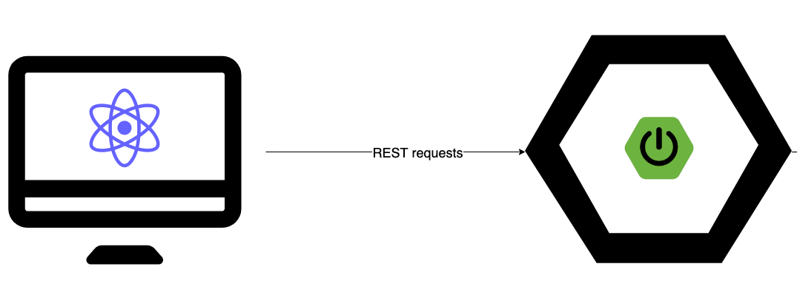

# Coding assignment: TODO app

### Project title
<hr>

A Todo app using Spring Boot as RESTful service and React as UI.

### Architecture
<hr>



### Database diagram


### Tech / Framework used

<h5>Front-end<h5>

- JavaScript
- React 18.2.0
- Government of Nova Scotia Forms & Services Building Blocks

<h5>Back-end<h5>

- Java 17
- SpringBoot 3.0.1
- JPA/Hibernate
- H2 in-memory database
- JUnit 5

### Back-end code style
<hr>

[Google Java format Conventions](https://github.com/google/google-java-format)


### How to run it?
<hr>

#### Docker

##### Development
```
docker-compose -p ns-todo up`
```

##### Production
```
docker-compose -p ns-todo-prod -f docker-compose.prod.yml up
```

#### Locally

##### Back-end

```
 cd todo-backend && ./gradlew bootRun
```

##### Front-end

```
cd todo-frontend && npm install && npm start
```

Open this [link](http://127.0.0.1:3000/) to access the main screen

